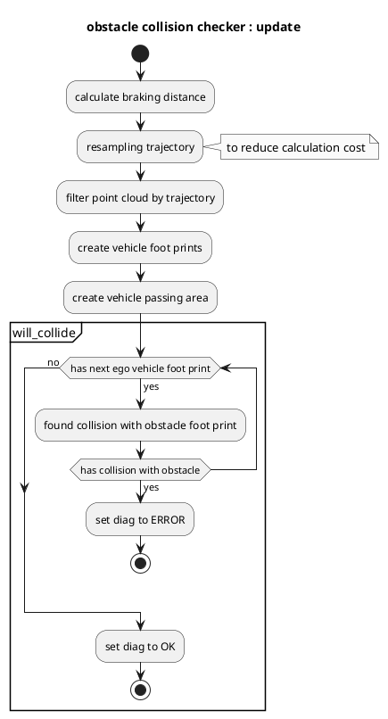

# obstacle_collision_checker

## 目的

`obstacle_collision_checker` 模块用于检查预测轨迹是否与障碍物碰撞，并在发现碰撞时发布诊断错误。

## 内部机制／算法

### 流程图

### 算法

### 数据检查

检查 `obstacle_collision_checker` 是否收到去地面点云、predicted_trajectory、参考轨迹和当前速度数据。

### 诊断更新

如果预测路径上发现碰撞，本模块将诊断状态设为 `ERROR`；否则设为 `OK`。

## 输入与输出

### 输入

| 名称 | 类型 | 说明 |
| ---------------------------------------------- | ----------------------------------------- | ------------------------------------------------------------------ |
| `~/input/trajectory` | `autoware_planning_msgs::msg::Trajectory` | 参考轨迹 |
| `~/input/trajectory` | `autoware_planning_msgs::msg::Trajectory` | 预测轨迹 |
| `/perception/obstacle_segmentation/pointcloud` | `sensor_msgs::msg::PointCloud2` | 自车应停车或避让的障碍物点云 |
| `/tf` | `tf2_msgs::msg::TFMessage` | TF |
| `/tf_static` | `tf2_msgs::msg::TFMessage` | 静态 TF |

### 输出

| 名称 | 类型 | 说明 |
| ---------------- | -------------------------------------- | ------------------------ |
| `~/debug/marker` | `visualization_msgs::msg::MarkerArray` | 可视化标记 |

## 参数

| 名称 | 类型 | 说明 | 默认值 |
| :------------------ | :------- | :------------------------------------------------- | :------------ |
| `delay_time` | `double` | 车辆延迟时间 [s] | 0.3 |
| `footprint_margin` | `double` | 车辆轮廓余量 [m] | 0.0 |
| `max_deceleration` | `double` | 自车停车的最大减速度 [m/s^2] | 2.0 |
| `resample_interval` | `double` | 轨迹重采样间隔 [m] | 0.3 |
| `search_radius` | `double` | 从轨迹搜索点云的距离 [m] | 5.0 |

## 假设与已知限制

要正确执行碰撞检查，需要获得合理的预测轨迹和无噪声的障碍物点云。
