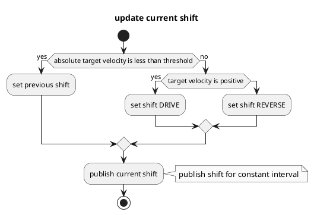

# 挡位决策器

## 目的

`autoware_shift_decider` 模块根据阿克曼控制命令决定挡位。

## 内部机制／算法

### 流程图

### 算法

## 输入与输出

### 输入

| 名称 | 类型 | 说明 |
| --------------------- | ------------------------------------- | ---------------------------- |
| `~/input/control_cmd` | `autoware_control_msgs::msg::Control` | 车辆控制命令。 |

### 输出

| 名称 | 类型 | 说明 |
| ------------------ | ----------------------------------------- | ---------------------------------- |
| `~output/gear_cmd` | `autoware_vehicle_msgs::msg::GearCommand` | 前进或后退的挡位。 |

## 参数

无。

## 假设与已知限制

待确定。
