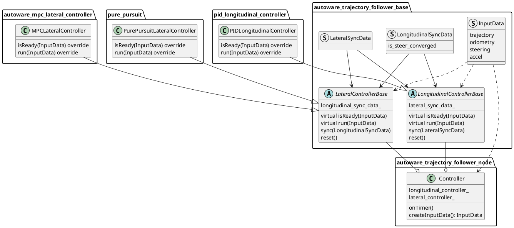

<a id="trajectory-follower-nodes"></a>

# 轨迹跟踪节点

<a id="purpose"></a>

## 目的

生成控制命令，以跟踪给定轨迹。

<a id="design"></a>

## 设计

本节点承载通过继承 [autoware_trajectory_follower_base](../autoware_trajectory_follower_base/README.md#trajectory-follower) 功能包中的控制器类所实现的功能。节点持有这些功能的实例，向其提供输入数据进行计算，并发布控制命令。

默认使用如下 `Controller` 类的控制器实例。



`Controller` 类的处理流程如下。

```cpp
// 1. create input data
const auto input_data = createInputData(*get_clock());
if (!input_data) {
  return;
}

// 2. check if controllers are ready
const bool is_lat_ready = lateral_controller_->isReady(*input_data);
const bool is_lon_ready = longitudinal_controller_->isReady(*input_data);
if (!is_lat_ready || !is_lon_ready) {
  return;
}

// 3. run controllers
const auto lat_out = lateral_controller_->run(*input_data);
const auto lon_out = longitudinal_controller_->run(*input_data);

// 4. sync with each other controllers
longitudinal_controller_->sync(lat_out.sync_data);
lateral_controller_->sync(lon_out.sync_data);

// 5. publish control command
control_cmd_pub_->publish(out);
```

向纵向控制器提供转向收敛信息后，当以下参数均为 `true` 时，可以在停车期间控制转向。

- 横向控制器
  - `keep_steer_control_until_converged`
- 纵向控制器
  - `enable_keep_stopped_until_steer_convergence`

<a id="inputs-outputs-api"></a>

### 输入、输出与 API

<a id="inputs"></a>

#### 输入

- `autoware_planning_msgs/Trajectory`：需要跟踪的参考轨迹。
- `nav_msgs/Odometry`：当前里程计。
- `autoware_vehicle_msgs/SteeringReport`：当前转向状态。

<a id="outputs"></a>

#### 输出

- `autoware_control_msgs/Control`：同时包含横向和纵向命令的消息。
- `autoware_control_msgs/ControlHorizon`：同时包含横向和纵向时域命令的消息。默认不发布。使用此消息可能提升车辆控制性能；启用发布后，可将其作为实验性话题使用。

<a id="parameter"></a>

#### 参数

- `trajectory_reference_mode`：`spatial` 或 `temporal`（默认：`spatial`）。
  - `spatial`：基于距离跟踪参考轨迹，根据距离和速度
    计算各预测点的时间步长。
  - `temporal`：直接使用参考轨迹的 `time_from_start` 字段，按时间步
    跟踪轨迹。
  - 此参数在这里声明，并与横向（MPC）和纵向（PID）
    控制器共享。
- `ctrl_period`：控制命令的发布周期。
- `timeout_thr_sec`：输入消息超过此时长后将被丢弃，单位秒。
  - 每当节点收到各控制器的横向和纵向命令时，如果同时满足以下两个条件，就发布 `Control`。
    1. 两类命令均已收到。
    2. 最近收到的命令未超过 `timeout_thr_sec` 定义的有效时长。
- `cyclic_message_timeout_thr_sec`：通过诊断更新器监控输入轨迹消息的时长阈值，单位秒（默认：0.9）。
  - 出现以下情况时，诊断更新器报告 ERROR 状态：
    1. 尚未收到任何轨迹消息。
    2. 距上次收到轨迹消息的时间超过此阈值。
  - 此参数有助于监控轨迹输入流的健康状况。
- `lateral_controller_mode`：`mpc` 或 `pure_pursuit`。
  - （目前纵向控制器只有 `PID`。）
- `enable_control_cmd_horizon_pub`：是否发布 `ControlHorizon`（默认：false）。

<a id="debugging"></a>

## 调试

横向和纵向控制器通过 `autoware_internal_debug_msgs/Float32MultiArrayStamped` 消息发布调试信息。

`config` 文件夹中提供了 [PlotJuggler](https://github.com/facontidavide/PlotJuggler) 配置文件，加载后可自动订阅并可视化有助于调试的信息。

此外，MPC 预测轨迹通过 `output/lateral/predicted_trajectory` 话题发布，可在 Rviz 中可视化。
