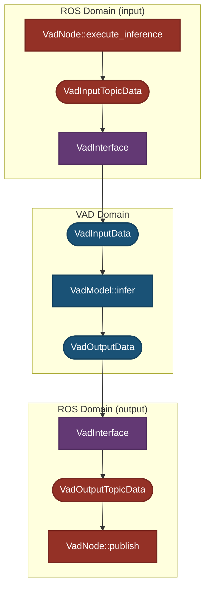

# 设计

本文说明 `autoware_tensorrt_vad` 的关键设计概念。

## 背景与范围

将感知和规划设计为松耦合组件有利于轻松构建稳定的自动驾驶车辆，但仍存在以下挑战：

- 感知与规划架构之间的接口设计限制了从感知传递到规划的信息量。
  - 例如，如果规划组件需要处理边走路边使用手机的行人，就必须将接口设计为可从感知向规划传递“该行人正在边走路边使用手机”这类信息。

近年来，人们提出了利用大量数据训练传感器输入规划器（也称 E2E）的方法，以应对这些挑战。考虑到 Autoware 中存在希望使用传感器输入规划器（也称 E2E）的用户，我们为 E2E 方法之一的 [VAD: Vectorized Scene Representation for Efficient Autonomous Driving](https://arxiv.org/abs/2303.12077) 添加了 ROS 节点。

## 目标与非目标

- 目标
  - 让希望使用传感器输入规划器（也称 E2E）的用户能够轻松与 Autoware 集成

- 非目标
  - 创建只能用于特定传感器或车辆、无法用于其他设备的 ROS 节点

## 概念

- [分离 ROS 与 CUDA 领域](#separation-between-ros-and-cuda-domains)
  - ROS 话题类型的更改不影响 CUDA 实现
  - CUDA 版本或接口的更改不影响 ROS 节点
- [分离模型架构与部署参数](#separation-between-model-architecture-and-deployment-parameters)
- [适应 Autoware `camera_id` 变化的可扩展设计](#extensible-design-for-autoware-camera_id-changes)
  - 即使前置相机 ID 从 `0` 改为 `1`，也可通过更改参数应对，而无需大幅修改设计

- 重要类的关键设计概念分别记录于：
  - [VadNode](./design_vad_node.md)
  - [VadInterface](./design_vad_interface.md)
  - [VadModel](./design_vad_model.md)
- 影响整个系统的其他设计考虑记录于[此处](#additional-design-considerations)
- 编码规范记录于[此处](#coding-standards)

### 分离 ROS 与 CUDA 领域

`autoware_tensorrt_vad` 明确划分为两个领域：“ROS/Autoware 领域”（`VadNode`）和“CUDA 领域”（`VadModel`）。

- **ROS 领域职责**：
  - 订阅和发布 ROS 话题
    - 验证话题丢失与同步
  - 与 Autoware 集成

- **接口职责**：
  - 输入处理
    - 坐标变换
    - 将 ROS 话题（`VadInputTopicData`）转换为 `VadInputData`
      - 与 CUDA 无关的预处理
    - 相机 ID 映射
  - 输出处理
    - 坐标变换
    - 将 `VadOutputData` 转换为 ROS 话题（`VadOutputTopicData`）
      - 与 CUDA 无关的后处理

- **CUDA 领域职责**：
  - 相机图像预处理（依赖 CUDA）
  - VAD 推理（从 `VadInputData` 到 `VadOutputData`）
  - 输出后处理（依赖 CUDA）

接口（`VadInterface`）连接 ROS 领域（`VadNode`）和 CUDA 领域（`VadModel`），旨在最大程度降低两个领域之间变更的影响。

---

#### 依赖关系图

```mermaid
graph TD
    VadNode["VadNode"]
    VadInterface["VadInterface"]
    VadInputTopicData(["VadInputTopicData"])
    VadOutputTopicData(["VadOutputTopicData"])
    VadModel["VadModel"]
    VadInputData(["VadInputData"])
    VadOutputData(["VadOutputData"])
    VadNode --> VadInputTopicData
    VadNode --> VadOutputTopicData
    VadInterface --> VadInputTopicData
    VadInterface --> VadOutputTopicData
    VadInterface --> VadInputData
    VadInterface --> VadOutputData
    VadModel --> VadInputData
    VadModel --> VadOutputData

    style VadNode fill:#943126,stroke:#78281F,stroke-width:2px,color:#FFFFFF;
    style VadModel fill:#1A5276,stroke:#154360,stroke-width:2px,color:#FFFFFF;
    style VadInterface fill:#633974,stroke:#512E5F,stroke-width:2px,color:#FFFFFF;

    style VadInputTopicData fill:#943126,stroke:#78281F,stroke-width:2px,color:#FFFFFF;
    style VadOutputTopicData fill:#943126,stroke:#78281F,stroke-width:2px,color:#FFFFFF;

    style VadInputData fill:#1A5276,stroke:#154360,stroke-width:2px,color:#FFFFFF;
    style VadOutputData fill:#1A5276,stroke:#154360,stroke-width:2px,color:#FFFFFF;

    %% Links to source code files
    click VadNode "https://github.com/autowarefoundation/autoware_universe/tree/main/e2e/autoware_tensorrt_vad/src/vad_node.hpp" "VadNode header file"
    click VadInterface "https://github.com/autowarefoundation/autoware_universe/tree/main/e2e/autoware_tensorrt_vad/src/vad_interface.hpp" "VadInterface header file"
    click VadModel "https://github.com/autowarefoundation/autoware_universe/tree/main/e2e/autoware_tensorrt_vad/src/vad_model.hpp" "VadModel header file"
    click VadInputTopicData "https://github.com/autowarefoundation/autoware_universe/tree/main/e2e/autoware_tensorrt_vad/src/data_types.hpp" "Data types header file"
    click VadOutputTopicData "https://github.com/autowarefoundation/autoware_universe/tree/main/e2e/autoware_tensorrt_vad/src/data_types.hpp" "Data types header file"
    click VadInputData "https://github.com/autowarefoundation/autoware_universe/tree/main/e2e/autoware_tensorrt_vad/src/data_types.hpp" "Data types header file"
    click VadOutputData "https://github.com/autowarefoundation/autoware_universe/tree/main/e2e/autoware_tensorrt_vad/src/data_types.hpp" "Data types header file"
```

- `VadInterface`：ROS 与 CUDA 领域之间的接口

- `VadInputData`、`VadOutputData`：CUDA 领域（`VadModel`）中用于推理的数据结构

- `VadModel`：使用 CUDA 和 TensorRT 的推理模型

`VadInterface` 依赖 ROS 领域数据（`VadInputTopicData`、`VadOutputTopicData`）和 CUDA 领域数据（`VadInputData`、`VadOutputData`），负责这些数据格式之间的转换。

`VadModel` 在 CUDA 领域内**仅**依赖 `VadInputData` 和 `VadOutputData`。

这种依赖结构使 `VadInterface` 能够作为 ROS 与 CUDA 领域之间的缓冲层，隔离各自职责并尽量减少变更影响。具体来说，该设计实现了以下效果：

- 当 ROS/Autoware 侧需要修改（例如 ROS 话题名称或内容变更）时，无需修改 `VadModel`、`VadInputData` 和 `VadOutputData`
- 当 CUDA/TensorRT 侧需要修改（例如 CUDA/TensorRT 版本变更）时，无需修改 `VadInputTopicData` 和 `VadOutputTopicData`

---

#### 处理流程图

- 话题转换和坐标变换由接口（`VadInterface`）处理

- 推理处理完全封装在 `VadModel` 内

---

#### 预期用例

##### 为 VAD 添加新输入

- 通过重新训练 ONNX 为 `VadModel` 添加新输入
- 修改 `VadNode` 以订阅新话题
- 将话题添加到 `VadInputTopicData`
- 修改 `VadInterface` 中的输入转换处理
- 向 `VadInputData` 添加成员

### 分离模型架构与部署参数

- 模型架构参数（网络结构、归一化、训练数据集类别）定义于 `vad-carla-tiny.param.json`（随模型下载至 `~/autoware_data/ml_models/vad/v0.1/`）
- 部署参数（硬件设置、文件路径、检测阈值）配置于 [`vad_carla_tiny.param.yaml`](../config/vad_carla_tiny.param.yaml)
  - 目标类别重映射参数添加于 [`object_class_remapper_carla_tiny.param.yaml`](../config/object_class_remapper_carla_tiny.param.yaml)
    - 遵循 [`autoware_bevfusion`](../../../perception/autoware_bevfusion/README.md) 的先例

#### 预期用例

| 用例                         | vad_carla_tiny.param.yaml | vad-carla-tiny.param.json | object_class_remapper_carla_tiny.param.yaml                  |
| -------------------------------- | ------------------------- | ------------------------- | ------------------------------------------------------------ |
| 模型架构变更       | 不修改             | 修改                    | 仅在 VAD ONNX 输出类别定义变更时修改    |
| 部署配置变更 | 修改                    | 不修改             | 仅在 Autoware 中的目标类别定义变更时修改 |

### 适应 Autoware `camera_id` 变化的可扩展设计

- 该设计可扩展，以适应 Autoware 中使用的 `camera_id` 变更
- Autoware 使用的 `camera_id` 仅影响 `VadInterface`
  - 不影响 `VadInputData` 或 `VadModel`
- 只需修改 `autoware_to_vad_camera_mapping` 即可处理相机 ID 变更

#### 预期用例

##### 更改 VAD 输入使用的相机图像 ID 时

- 修改 ROS 参数文件（[`vad_carla_tiny.param.yaml`](../config/vad_carla_tiny.param.yaml)）中的 `autoware_to_vad_camera_mapping`

### 其他设计考虑

本节包含影响整个系统、但尚不足以单独撰写文档页面的设计概念。

- 数据类型（例如 `VadInputData`）集中声明于 `data_types.hpp`

### 编码规范

- 不要使用 `int`，请改用 `int32_t`。
- 不要仅用 `char` 表示 1 字节数据，请改用 `uint8_t`。
- 不要使用 `printf` 或 `cout`，请改用 `RCLCPP_INFO_THROTTLE`、`RCLCPP_DEBUG_THROTTLE` 和 `RCLCPP_ERROR_THROTTLE`。
- 地图坐标需要较高精度，请使用 `double`。
