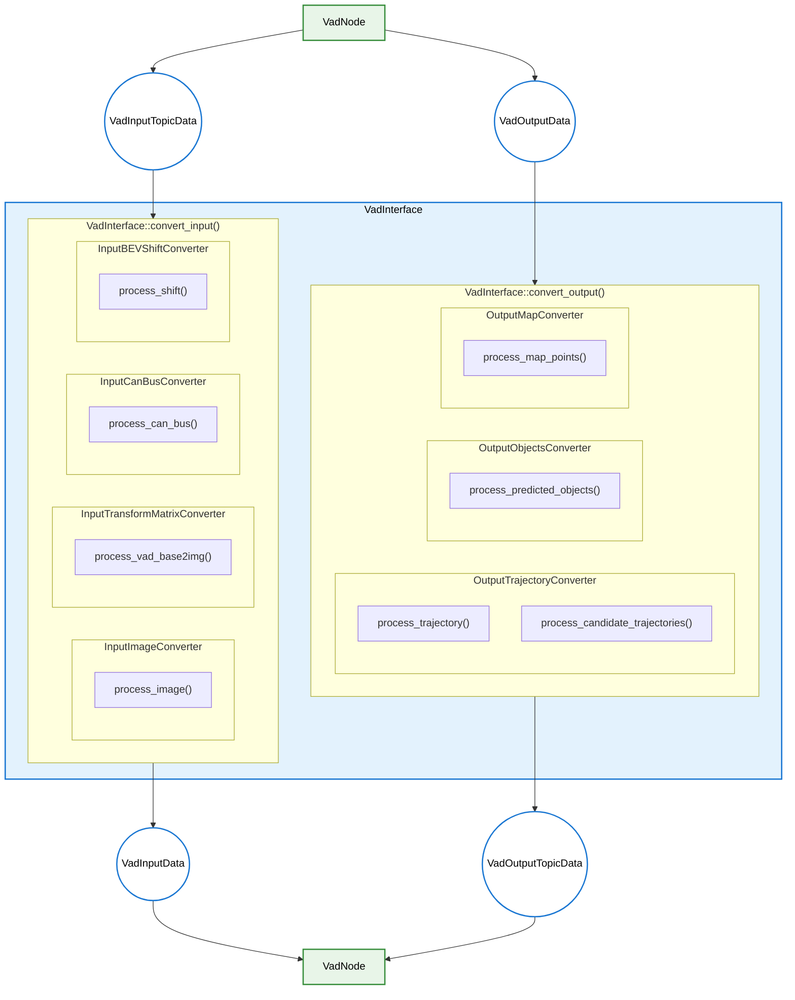

# VadInterface 设计

- 代码：[vad_interface.cpp](../lib/vad_interface.cpp) [vad_interface.hpp](../src/vad_interface.hpp)

## 职责

- 将 `VadInputTopicData` 转换为 `VadInputData`，并将 `VadOutputData` 转换为 `VadOutputTopicData`
  - 通过 [`CoordinateTransformer`](../src/coordinate_transformer.hpp) 管理 TF 查询
    - 通过 TF 缓冲区提供相机坐标系变换（base_link → 相机坐标系）
    - 注意：对于 CARLA，VAD 坐标 = Autoware base_link 坐标（无需转换）
  - 转换输入数据（所有转换器均位于 `vad_interface::` 命名空间）
    - 通过 [`InputImageConverter`](../src/input_converter/image_converter.hpp) 转换输入图像
    - 通过 [`InputTransformMatrixConverter`](../src/input_converter/transform_matrix_converter.hpp) 转换输入变换矩阵
      - 使用 `CoordinateTransformer::lookup_base2cam()` 构建变换矩阵
    - 通过 [`InputCanBusConverter`](../src/input_converter/can_bus_converter.hpp) 转换输入里程计数据
    - 通过 [`InputBEVShiftConverter`](../src/input_converter/bev_shift_converter.hpp) 计算 BEV 偏移
  - 转换输出数据（所有转换器均位于 `vad_interface::` 命名空间）
    - 通过 [`OutputTrajectoryConverter`](../src/output_converter/trajectory_converter.hpp) 转换输出规划轨迹
    - 通过 [`OutputObjectsConverter`](../src/output_converter/objects_converter.hpp) 转换输出预测目标
    - 通过 [`OutputMapConverter`](../src/output_converter/map_converter.hpp) 转换输出地图标记

- 负责仅使用 CPU 的预处理和后处理（不使用 CUDA）
- 首次成功计算后缓存 `vad_base2img` 变换矩阵，避免重复 TF 查询

## 处理流程图

### 函数职责

### API 函数（公开）

`VadNode` 在推理前调用 `convert_input()`，在推理后调用 `convert_output()`。

- [`convert_input(const VadInputTopicData&)`](../lib/vad_interface.cpp)：将 `VadInputTopicData` 转换为 `VadInputData`
  - 通过 [`InputTransformMatrixConverter::process_vad_base2img()`](../src/input_converter/transform_matrix_converter.hpp) 验证并缓存 `vad_base2img` 变换
  - 通过 [`InputCanBusConverter::process_can_bus()`](../src/input_converter/can_bus_converter.hpp) 处理 CAN 总线数据
  - 通过 [`InputBEVShiftConverter::process_shift()`](../src/input_converter/bev_shift_converter.hpp) 计算 BEV 偏移
  - 通过 [`InputImageConverter::process_image()`](../src/input_converter/image_converter.hpp) 处理图像
  - 更新 `prev_can_bus_` 供下一帧使用

- [`convert_output(const VadOutputData&, ...)`](../lib/vad_interface.cpp)：将 `VadOutputData` 转换为 `VadOutputTopicData`
  - 通过 [`OutputTrajectoryConverter::process_candidate_trajectories()`](../src/output_converter/trajectory_converter.hpp) 转换候选轨迹
  - 通过 [`OutputTrajectoryConverter::process_trajectory()`](../src/output_converter/trajectory_converter.hpp) 转换主轨迹
  - 通过 [`OutputMapConverter::process_map_points()`](../src/output_converter/map_converter.hpp) 转换地图折线
  - 通过 [`OutputObjectsConverter::process_predicted_objects()`](../src/output_converter/objects_converter.hpp) 转换预测目标

### 转换器架构

所有转换器类均位于 `autoware::tensorrt_vad::vad_interface::` 命名空间，并继承基础 `Converter` 类，该类提供对 `CoordinateTransformer` 和配置的访问。

## 关键设计细节

### CoordinateTransformer

- 封装 TF 缓冲区，并提供 `lookup_base2cam(frame_id)` 用于相机变换
- 对于 CARLA：VAD 坐标与 Autoware base_link 完全相同（无需坐标转换）
- 由 `InputTransformMatrixConverter` 使用以构建 `vad_base2img` 矩阵

### 缓存策略

- 首次成功计算后缓存 `vad_base2img_transform_`
- 缓存前验证变换（检查非零值）
- 避免每帧重复 TF 查询

### 转换器依赖注入

- 所有转换器均在构造函数中接收 `CoordinateTransformer` 引用和配置
- 支持单元测试和关注点分离

## 待办事项

- 尽管数据并非来自 CAN BUS，仍使用“CanBus”这一名称。这种命名优先遵循 [VAD 代码使用的记法](https://github.com/hustvl/VAD/blob/36047b6b5985e01832d8a2ecb0355d7f3c753ee1/projects/mmdet3d_plugin/datasets/nuscenes_vad_dataset.py#L1375-L1382)。但它可能引起混淆，因此应考虑更合适的名称。
