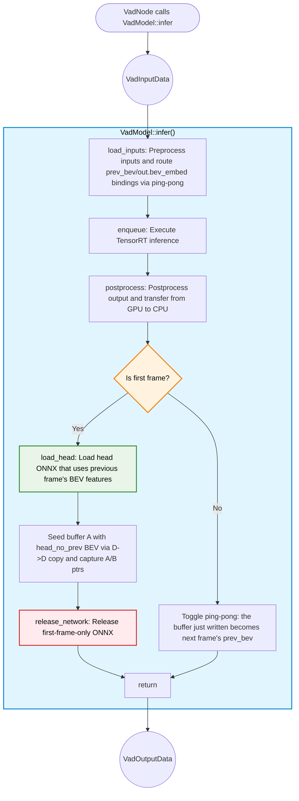
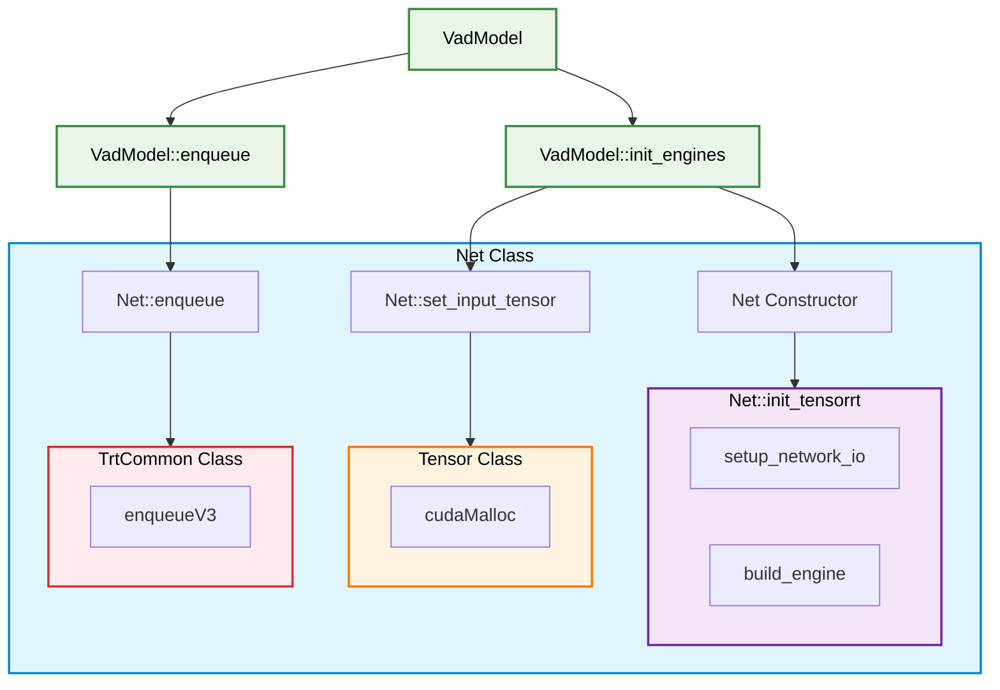
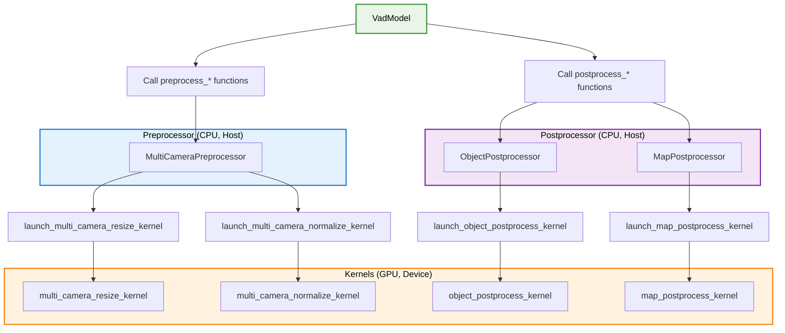

# VadModel 设计

- 代码：[vad_model.hpp](../src/vad_model.hpp)

## 职责

- 负责基于 CUDA 的处理和 TensorRT 推理
- 接收 `VadInputData`，执行推理，并返回 `VadOutputData`
- 通过 `MultiCameraPreprocessor` 使用 CUDA 预处理多相机图像
- 管理两阶段推理：骨干网络和头部网络（有/无 prev_bev）
- 使用 `Tensor` 类在主机（CPU）与设备（GPU）之间传输数据
- 使用 CUDA 对输出进行后处理：
  - 通过 `ObjectPostprocessor` 进行目标检测
  - 通过 `MapPostprocessor` 处理地图折线
- 跨帧管理 prev_bev 特征以提供时间上下文
- 动态加载/卸载网络（首帧后释放 `head_no_prev`）

## 处理流程图

### 函数职责

### API 函数（公开）

- [`infer(const VadInputData&)`](../src/vad_model.hpp)：主推理流程
  1. 选择头部网络（首帧使用 `head_no_prev`，后续帧使用 `head`）
  2. 调用 `load_inputs()` 预处理输入，并（对 `head`）通过乒乓方式路由 prev_bev/out.bev_embed 绑定
  3. 调用 `enqueue()` 执行骨干网络和头部网络
  4. 调用 `postprocess()` 提取输出并传输至 CPU
  5. 首帧：调用 `load_head()`，使用首个 BEV 初始化乒乓缓冲区 A（一次 D→D 复制），然后释放 `head_no_prev`
  6. 后续帧：切换乒乓选择器，使刚写入的缓冲区成为下一帧的 `prev_bev`
  7. 返回包含轨迹、目标和地图折线的 `VadOutputData`

### 内部函数（私有）

- [`init_engines()`](../src/vad_model.hpp)：构造时初始化 TensorRT 网络
  - 创建 `Backbone`、`Head` 和 `Head_no_prev` 网络实例
  - 设置外部输入绑定，以便网络之间共享内存
  - 记录网络之间的绑定连接日志

- [`load_inputs()`](../src/vad_model.hpp)：准备推理输入
  - 使用 `MultiCameraPreprocessor::preprocess_images()` 预处理多相机图像
  - 加载元数据：`shift`、`vad_base2img`（lidar2img）、`can_bus`
  - 对于 `head`，调用 `trt_common->setTensorAddress("prev_bev", ...)` 和 `setTensorAddress("out.bev_embed", ...)` 交换乒乓缓冲区 A/B（`head_no_prev` 无需此操作）

- [`enqueue()`](../src/vad_model.hpp)：执行推理
  - 将骨干网络加入执行队列
  - 将选定的头部网络加入执行队列
  - 同步 CUDA 流，等待完成

- [`postprocess()`](../src/vad_model.hpp)：提取并处理输出
  - 从 GPU 获取 `out.ego_fut_preds`（轨迹预测）
  - 通过 `ObjectPostprocessor::postprocess_objects()` 处理检测目标
  - 通过 `MapPostprocessor::postprocess_map_preds()` 处理地图折线
  - 对轨迹点求累积和，将增量转换为绝对位置
  - 提取所有指令的轨迹及选定指令的轨迹
  - 返回包含全部已处理输出的 `VadOutputData`

- [`release_network()`](../src/vad_model.hpp)：释放网络资源
  - 清空绑定映射
  - 重置网络并从 `nets_` 映射中移除
  - 首帧后调用，以释放 `head_no_prev`

- [`load_head()`](../src/vad_model.hpp)：初始化支持 prev_bev 的头部网络
  - VAD 需要上一帧的 BEV 特征作为输入
  - 首帧使用 `head_no_prev`（无上一帧 BEV 可用）
  - 首帧后切换为 `head`，使用上一次推理的 `prev_bev`
  - 设置外部绑定，连接骨干网络输出

### 设计概念

#### 日志记录器模式

- **目标**：`VadModel` 不应依赖 ROS，但需要日志记录能力
- **解决方案**：基于模板的依赖注入，使用抽象日志记录器接口
- [`VadLogger`](../src/ros_vad_logger.hpp)：定义日志记录接口的抽象基类
- [`RosVadLogger`](../src/ros_vad_logger.hpp)：使用 ROS 2 日志宏（`RCLCPP_INFO_THROTTLE` 等）的具体实现
- `VadModel<LoggerType>`：以日志记录器类型为参数的模板类
  - 通过 `static_assert` 强制 `LoggerType` 必须继承 `VadLogger`
  - 支持使用模拟日志记录器进行单元测试
  - 保持 ROS 与 CUDA 领域之间一致的日志行为
- **权衡**：遵循 C++ 模板约束，模板实现要求全部代码位于头文件（`.hpp`）中

#### 网络架构

- 每个 ONNX 文件对应一个 `Net` 类
- `Net` 类使用 [`autoware_tensorrt_common`](../../../perception/autoware_tensorrt_common/README.md) 构建和执行 TensorRT 引擎
- 三种网络类型：
  1. **Backbone**：处理多相机图像并提取特征
  2. **Head_no_prev**：不使用上一帧 BEV 特征的首帧头部网络
  3. **Head**：使用上一次推理的 `prev_bev` 的后续帧头部网络
- 通过 [`Tensor`](../src/networks/tensor.hpp) 类管理内存
  - 使用 `cudaMalloc` 分配 GPU 内存
  - 使用 `cudaMemcpyAsync` 进行主机↔设备传输
- 绑定共享：一个网络的输出可直接用作另一个网络的输入（例如骨干网络输出 → 头部网络输入）

##### 网络类：API 函数

- **构造函数** → [`init_tensorrt`](../src/networks/net.hpp)
  - 模型初始化时由 `VadModel::init_engines` 调用
  - **setup_network_io**：在 [`Backbone`](../src/networks/backbone.hpp) 和 [`Head`](../src/networks/head.hpp) 中采用不同实现
    - 定义输入/输出张量的名称、形状和数据类型
  - **build_engine**：创建 TensorRT 引擎
    - 实例化 [`TrtCommon`](../../../perception/autoware_tensorrt_common/include/autoware/tensorrt_common/tensorrt_common.hpp) 以管理引擎
    - 实例化 [`NetworkIO`](../../../perception/autoware_tensorrt_common/include/autoware/tensorrt_common/utils.hpp) 以配置 I/O
    - 从 ONNX 文件构建引擎或从缓存加载

- **set_input_tensor**：由 `VadModel::init_engines` 和 `VadModel::load_head` 调用
  - 接收外部绑定映射（来自其他网络的张量）
  - 通过 [`Tensor`](../lib/networks/tensor.cpp) 构造函数为新张量分配 GPU 内存
  - 为外部输入设置内存共享（避免冗余复制）

- **enqueue**：由 `VadModel::enqueue` 调用
  - 通过 [`TrtCommon::enqueueV3`](../../../perception/autoware_tensorrt_common/include/autoware/tensorrt_common/tensorrt_common.hpp) 执行 TensorRT 推理
  - 在 CUDA 流上异步运行
  - 注意：当前 TensorRT 版本使用 `enqueueV3`；若 TensorRT API 发生变化，需更新

#### CUDA 预处理器与后处理器架构

预处理器和后处理器类封装 CUDA 内核，并向 `VadModel` 提供清晰的 C++ 接口。

**预处理器/后处理器类**（CPU 侧封装）：

- [`MultiCameraPreprocessor`](../src/networks/preprocess/multi_camera_preprocess.hpp)：多相机图像预处理
- [`ObjectPostprocessor`](../src/networks/postprocess/object_postprocess.hpp)：3D 目标检测后处理
- [`MapPostprocessor`](../src/networks/postprocess/map_postprocess.hpp)：地图折线后处理

**处理流程**：

1. `VadModel` 调用 `preprocess_*()` 或 `postprocess_*()` 方法
2. 这些方法调用 `launch_*_kernel()` 函数
3. 内核启动函数计算 CUDA 网格/线程块维度
4. CUDA 内核在 GPU 上执行

**CUDA 内核启动函数**：

- [`launch_multi_camera_resize_kernel`](../lib/networks/preprocess/multi_camera_preprocess_kernel.cu)：将图像缩放至目标分辨率
- [`launch_multi_camera_normalize_kernel`](../lib/networks/preprocess/multi_camera_preprocess_kernel.cu)：归一化像素值
- [`launch_object_postprocess_kernel`](../lib/networks/postprocess/object_postprocess_kernel.cu)：筛选并解码目标检测结果
- [`launch_map_postprocess_kernel`](../lib/networks/postprocess/map_postprocess_kernel.cu)：解码地图折线

**优点**：

- 关注点分离：C++ 封装逻辑与 CUDA 内核逻辑相互分离
- 可测试性：可模拟预处理器/后处理器
- 性能：内核针对 GPU 并行执行进行优化

## 关键设计细节

### 两阶段网络加载

- **首帧**：使用 `head_no_prev`（无需时间上下文）
- **后续帧**：使用 `head`（整合上一帧的 `prev_bev`）
- **内存优化**：首帧后释放 `head_no_prev`，以释放 GPU 内存

### 内存管理策略

- **绑定共享**：网络输出可直接连接为其他网络的输入
- **Tensor 类**：封装 CUDA 内存操作（malloc、copy、free）
- **BEV 乒乓机制**：`head` 引擎的 `prev_bev` 和 `out.bev_embed` 共享两个持久 GPU 缓冲区，每帧通过 `setTensorAddress` 交换角色。稳定运行时每帧复制次数 = 0；仅在从 `head_no_prev` 切换到 `head` 时发生一次设备到设备复制。

### 异步执行

- 所有 CUDA 操作使用单个 `cudaStream_t stream_` 成员
- 操作异步执行，但在后处理前同步
- 在可能的情况下支持计算重叠

## 待办事项

- **量化**：当前使用 FP32；INT8 量化可改善速度和内存效率
- **多流执行**：可使用多个流以流水线方式执行骨干网络和头部网络
