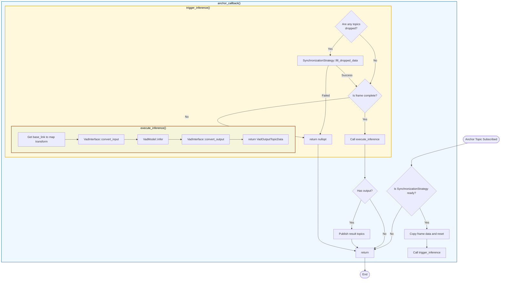

# VadNode 设计

- 代码：[vad_node.cpp](../src/vad_node.cpp)、[vad_node.hpp](../src/vad_node.hpp)

## 职责

- 订阅 ROS 话题、执行回调函数，并将数据封装为 `VadInputTopicData`
- 管理 TF 缓冲区，监听 `/tf_static` 以获取相机变换
- 使用 `SynchronizationStrategy` 检查数据就绪状态并处理丢失数据
- 检查是否可以执行推理、执行推理、获取 `VadOutputTopicData` 并发布
- 读取 ROS 参数，并为 `VadInterface` 和 `VadModel` 创建配置
- 使用适当配置初始化 VAD 模型和接口

## 处理流程图

- 同步检查和丢失数据处理由 [`SynchronizationStrategy`](../src/synchronization_strategy.hpp) 管理。
  - 当前实现为 `FrontCriticalSynchronizationStrategy`，要求前置相机图像可用
- `VadInputTopicData` ↔ `VadInputData` 及 `VadOutputData` ↔ `VadOutputTopicData` 之间的转换由 [`VadInterface`](../src/vad_interface.hpp) 处理。

### 函数职责

- [`anchor_callback()`](../src/vad_node.cpp)：接收到前置相机图像（锚定话题）时触发的回调
  - 使用 `SynchronizationStrategy::is_ready()` 检查所有必需数据是否可用
  - 复制帧数据、重置累积器，并调用 `trigger_inference()`
- [`trigger_inference()`](../src/vad_node.cpp)：检查丢失数据，必要时填充，并触发推理
  - 使用 `SynchronizationStrategy::is_dropped()` 检测缺失数据
  - 使用 `SynchronizationStrategy::fill_dropped_data()` 处理丢帧
  - 在调用 `execute_inference()` 前验证帧完整性
- [`execute_inference()`](../src/vad_node.cpp)：执行 VAD 推理流程
  - 获取 base_link 到 map 的变换
  - 调用 `VadInterface::convert_input()`，将 `VadInputTopicData` → `VadInputData`
  - 调用 `VadModel::infer()` 运行推理并获取 `VadOutputData`
  - 调用 `VadInterface::convert_output()`，将 `VadOutputData` → `VadOutputTopicData`
- [`publish()`](../src/vad_node.cpp)：将推理结果发布到 ROS 话题
  - 发布轨迹、候选轨迹、预测目标和地图标记
- [`initialize_vad_model()`](../src/vad_node.cpp)：节点构造后初始化 VadModel 和 VadInterface
  - 加载 ROS 参数并创建配置
  - 与 VadInterface 共享 TF 缓冲区以进行坐标变换

## 待办事项

- 订阅时过度使用回调可能增加 CPU 使用率。仅在需要对话题接收事件作出反应时使用回调，否则使用 `Subscription->take()`。
- 此类职责较多：从 ROS 参数创建配置、创建发布者和订阅者、回调函数、触发和执行推理，以及发布。如果可读性下降，应按职责拆分为独立类。
- 添加 FrontCritical 以外的 [`SynchronizationStrategy`](../src/synchronization_strategy.hpp)
  - 例如：前方 3 路图像均可用时视为已同步
