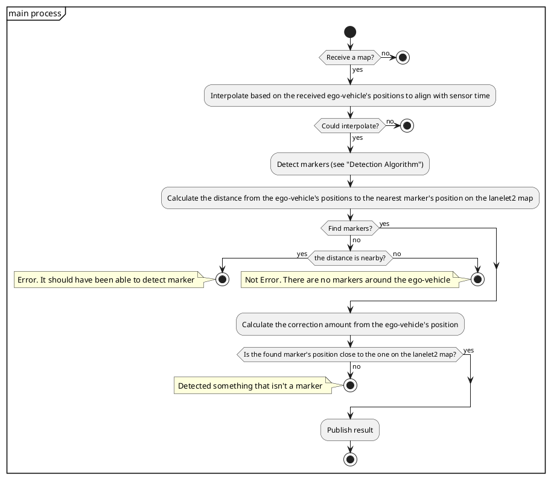

<a id="lidar-marker-localizer"></a>

# 激光雷达标记定位器

**LiDARMarkerLocalizer** 是基于反光标记检测的定位节点。

<a id="inputs-outputs"></a>

## 输入／输出

<a id="lidar_marker_localizer-node"></a>

### `lidar_marker_localizer` 节点

<a id="input"></a>

#### 输入

| 名称 | 类型 | 说明 |
| :--------------------- | :---------------------------------------------- | :------------------------------------------------------------------------------------------------------------- |
| `~/input/lanelet2_map` | `autoware_map_msgs::msg::HADMapBin` | Lanelet2 数据 |
| `~/input/pointcloud` | `sensor_msgs::msg::PointCloud2` | 点类型：Autoware 推荐使用 `PointXYZIRC`，此节点也支持 `PointXYZIRADRT`。[^1] |
| `~/input/ekf_pose` | `geometry_msgs::msg::PoseWithCovarianceStamped` | EKF 位姿 |

[^1]: 将 `PointXYZIRADRT` 的 `ring` 视为 `PointXYZIRC` 的 `channel`。

<a id="output"></a>

#### 输出

| 名称 | 类型 | 说明 |
| :------------------------------ | :---------------------------------------------- | :------------------ |
| `~/output/pose_with_covariance` | `geometry_msgs::msg::PoseWithCovarianceStamped` | 估计位姿 |
| `/diagnostics` | `diagnostic_msgs::msg::DiagnosticArray` | 诊断输出 |

<a id="for-debug"></a>

##### 调试用途

| 名称 | 类型 | 说明 |
| :------------------------------ | :---------------------------------------------- | :--------------------------------------------------- |
| `~/debug/pose_with_covariance` | `geometry_msgs::msg::PoseWithCovarianceStamped` | 估计位姿 |
| `~/debug/marker_detected` | `geometry_msgs::msg::PoseArray` | 检测到的标记位姿 |
| `~/debug/marker_mapped` | `visualization_msgs::msg::MarkerArray` | 已加载的地标，在 RViz 中显示为薄板 |
| `~/debug/marker_pointcloud` | `sensor_msgs::msg::PointCloud2` | 检测到的标记点云 |
| `~/debug/center_intensity_grid` | `nav_msgs::msg::OccupancyGrid` | 用于调试的中心强度栅格 |
| `~/debug/positive_grid` | `nav_msgs::msg::OccupancyGrid` | 用于调试的正匹配栅格 |
| `~/debug/negative_grid` | `nav_msgs::msg::OccupancyGrid` | 用于调试的负匹配栅格 |
| `~/debug/matched_grid` | `nav_msgs::msg::OccupancyGrid` | 用于调试的匹配模式栅格 |
| `~/debug/vote_grid` | `nav_msgs::msg::OccupancyGrid` | 用于标记检测调试的投票栅格 |

<a id="parameters"></a>

## 参数

{{ json_to_markdown("localization/autoware_landmark_based_localizer/autoware_lidar_marker_localizer/schema/lidar_marker_localizer.schema.json") }}

<a id="how-to-launch"></a>

## 启动方法

启动 Autoware 时，将 `pose_source` 设为 `lidar-marker`。

```bash
ros2 launch autoware_launch ... \
    pose_source:=lidar-marker \
    ...
```

<a id="design"></a>

## 设计

<a id="flowchart"></a>

### 流程图



<a id="detection-algorithm"></a>

## 检测算法


1. 沿 base_link 坐标系的 X 轴，以 `resolution` 为间隔，将激光雷达点云划分为多个环。
2. 查找强度与 `intensity_pattern` 匹配的部分。
3. 对每个环执行步骤 1 和 2，累积匹配索引，并将计数超过 `vote_threshold_for_detect_marker` 的部分识别为标记。

<a id="sample-dataset"></a>

## 示例数据集

- [示例 rosbag 和地图](https://drive.google.com/file/d/1FuGKbkWrvL_iKmtb45PO9SZl1vAaJFVG/view?usp=sharing)

此数据集采集于日本国土技术政策综合研究所的全尺寸隧道实验设施。
反光标记由[大成建设](https://www.taisei.co.jp/english/)安装。

<a id="collaborators"></a>

## 合作方

- [TIER IV](https://tier4.jp/en/)
- [大成建设](https://www.taisei.co.jp/english/)
  - [Yuri Shimizu](https://github.com/YuriShimizu824)
