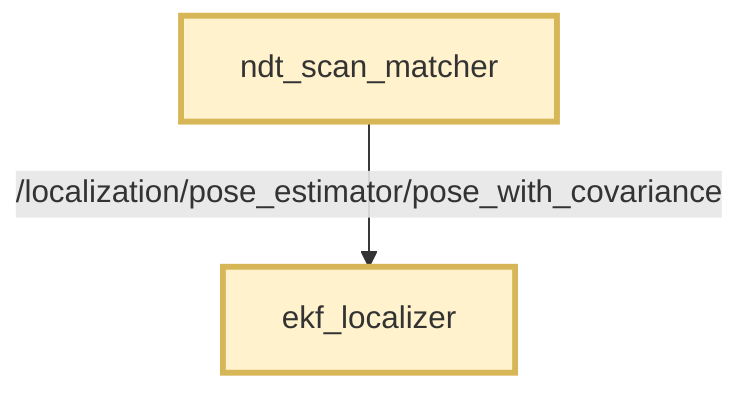
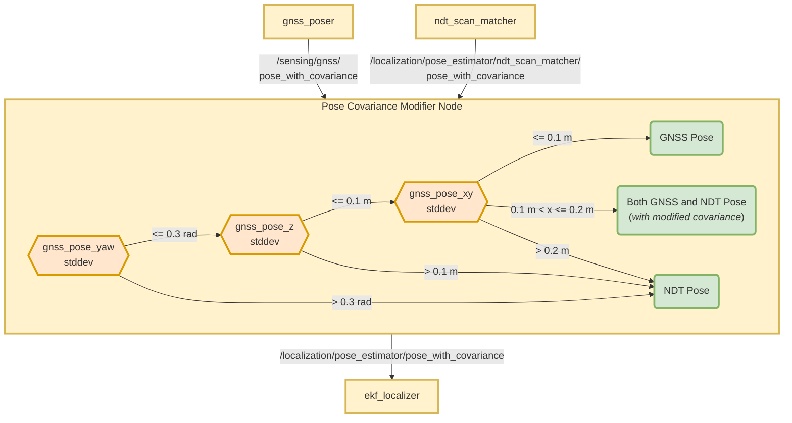

# Autoware 位姿协方差调整节点

## 用途

此功能包使实时定位能够同时使用 GNSS 和 NDT 位姿。

## 功能

此功能包接收带协方差的 GNSS（全球导航卫星系统）
和 NDT（正态分布变换）位姿。

它输出带协方差的位姿，具体有以下形式：

- 直接输出 GNSS 位姿及其协方差。
- 直接输出 NDT 位姿及其协方差。
- 同时输出 GNSS 和 NDT 位姿，并调整协方差。

> - 此功能包不会修改接收到的位姿信息。
> - 仅在特定条件下修改 NDT 协方差值。

## 假设

- NDT 匹配器提供具有固定协方差的位姿。
- NDT 匹配器无法提供动态、可靠的协方差值。

## 要求

- GNSS/INS 模块必须提供位置和姿态的标准差值（误差／RMSE）。
- 可能需要 RTK 支持，才能提供准确的位置和姿态信息。
- 需要带地理参考的地图。
- GNSS/INS 模块与 base_link 坐标系之间必须经过足够准确的标定。
- 在 GNSS/INS 和 NDT 系统均工作良好的环境中，两者得到的 `base_link` 位姿应当
  接近。

## 说明

GNSS 和 NDT 节点提供的带协方差位姿数据用于扩展卡尔曼滤波器（EKF）。

准确的协方差值对于 EKF 有效估计状态至关重要。

GNSS 系统生成可靠的标准差值，可将其转换为协方差。

但目前尚无可靠方法确定 NDT 位姿的协方差值。
Autoware 中的 NDT 匹配系统输出的是带预设协方差的位姿。

因此，此功能包根据 GNSS 系统提供的标准差值，
管理位姿来源的选择。

它还会根据 GNSS 标准差调整 NDT 位姿的协方差值。

## 流程图

### 不使用此功能包时

定位仅使用 NDT 位姿，GNSS 位姿仅用于初始化。

### 使用此功能包时

根据 GNSS 系统提供的标准差值，定位会使用 NDT 和 GNSS
位姿。

以下流程图展示处理过程和预定义阈值：

## 使用此功能包

> **Autoware 默认禁用此功能包，需要手动启用。**

要启用此功能包，需要将 `use_autoware_pose_covariance_modifier` 参数改为 `true`，该参数位于
[pose_twist_estimator.launch.xml](../../launch/tier4_localization_launch/launch/pose_twist_estimator/pose_twist_estimator.launch.xml#L3) 中。

### 未启用时（默认）

- [ndt_scan_matcher](https://github.com/autowarefoundation/autoware_core/tree/main/localization/autoware_ndt_scan_matcher) 的输出直接发送
  到 [ekf_localizer](https://github.com/autowarefoundation/autoware_core/tree/main/localization/autoware_ekf_localizer)。
  - 使用预设的协方差值。
  - **话题名称：** `/localization/pose_estimator/pose_with_covariance`
- GNSS 位姿不传入 ekf_localizer。
- 此节点不启动。

### 启用后

- [ndt_scan_matcher](https://github.com/autowarefoundation/autoware_core/tree/main/localization/autoware_ndt_scan_matcher) 的输出话题重命名
  - **原名称：** `/localization/pose_estimator/pose_with_covariance`。
  - **新名称：** `/localization/pose_estimator/ndt_scan_matcher/pose_with_covariance`。
- `ndt_scan_matcher` 的输出传入 `autoware_pose_covariance_modifier`。
- 此功能包的输出通过以下话题传给 [ekf_localizer](https://github.com/autowarefoundation/autoware_core/tree/main/localization/autoware_ekf_localizer)：
  - **话题名称：** `/localization/pose_estimator/pose_with_covariance`。

## 节点

### 订阅的话题

| 名称 | 类型 | 说明 |
| -------------------------------- | ----------------------------------------------- | ---------------------- |
| `input_gnss_pose_with_cov_topic` | `geometry_msgs::msg::PoseWithCovarianceStamped` | 输入 GNSS 位姿话题。 |
| `input_ndt_pose_with_cov_topic` | `geometry_msgs::msg::PoseWithCovarianceStamped` | 输入 NDT 位姿话题。 |

### 发布的话题

| 名称 | 类型 | 说明 |
| ----------------------------------- | ----------------------------------------------- | ---------------------------------------------------------------------------------------------------------------------- |
| `output_pose_with_covariance_topic` | `geometry_msgs::msg::PoseWithCovarianceStamped` | 输出位姿话题，由 ekf_localizer 功能包使用。 |
| `selected_pose_type` | `std_msgs::msg::String` | 声明此功能包输出使用的位姿来源 |
| `output/ndt_position_stddev` | `std_msgs::msg::Float64` | 输出 NDT 位姿在 XY 位置上的平均标准差。仅在 enable_debug_topics 为 true 时发布。 |
| `output/gnss_position_stddev` | `std_msgs::msg::Float64` | 输出 GNSS 位姿在 XY 位置上的平均标准差。仅在 enable_debug_topics 为 true 时发布。 |

### 参数

参数设置位于
[config/pose_covariance_modifier.param.yaml](config/pose_covariance_modifier.param.yaml) 中。

{{ json_to_markdown(
  "localization/autoware_pose_covariance_modifier/schema/pose_covariance_modifier.schema.json") }}

## 常见问题

### 如何处理不同的消息频率？

GNSS 和 NDT 位姿话题的频率可能不同。
GNSS 位姿话题的频率可能高于 NDT。

假设输入频率如下：

| 来源 | 频率 |
| ------ | --------- |
| GNSS | 200 Hz |
| NDT | 10 Hz |

此功能包根据当前模式，在收到相应位姿后立即发布输出。

最终结果：

| 模式 | 输出频率 |
| ---------- | ----------- |
| GNSS Only | 200 Hz |
| GNSS + NDT | 210 Hz |
| NDT Only | 10 Hz |

### 何时以及如何覆盖 NDT 协方差值？

| 模式 | 输出及协方差 |
| ---------- | ------------------------------------------- |
| GNSS Only | GNSS，不修改 |
| GNSS + NDT | **GNSS：** 不修改，**NDT：** 插值 |
| NDT Only | NDT，不修改 |

仅在 `GNSS + NDT` 模式下覆盖 NDT 协方差值。

这使系统能够在 `GNSS Only` 和 `NDT Only` 模式之间平滑过渡。

在此模式下，节点同时发布 NDT 和 GNSS 位姿。

#### NDT 协方差计算

当 `gnss_std_dev` 在其边界范围内增大时，`ndt_std_dev` 应在自身边界范围内按比例减小。

为此，首先进行线性插值：

- 基准值：`gnss_std_dev`
- 基准范围：[`threshold_gnss_stddev_xy_bound_lower`, `threshold_gnss_stddev_xy_bound_upper`]
- 目标范围：[`ndt_std_dev_bound_lower`, `ndt_std_dev_bound_upper`]
- 目标值：`ndt_std_dev_target`

- 最终值 = `ndt_std_dev_bound_lower` + `ndt_std_dev_bound_upper` - `ndt_std_dev_target`（用于反向变化）

