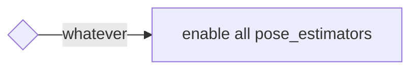

# autoware_pose_estimator_arbiter

目录：

- [摘要](#abstract)
- [接口](#interfaces)
- [架构](#architecture)
- [启动方法](#how-to-launch)
- [切换规则](#switching-rules)
- [位姿初始化](#pose-initialization)
- [后续计划](#future-plans)

<a id="abstract"></a>

## 摘要

此功能包启动多个位姿估计器，并提供根据情况停止或恢复特定位姿估计器的能力。
它提供临时的切换规则，未来将适配更多不同规则。

其他实现思路请参阅[此讨论](https://github.com/orgs/autowarefoundation/discussions/3878)。

<a id="why-do-we-need-a-stopresume-mechanism"></a>

### 为什么需要停止／恢复机制？

通过编辑启动文件，可以启动多个 pose_estimator，并使用卡尔曼滤波器融合其结果。
但由于计算成本较高，不宜直接采用这种方式。

尤其是 NDT 和 YabLoc 计算量较大，不建议同时运行。
此外，即使可以同时启用二者，其中一个输出不佳也可能影响卡尔曼滤波器。

> [!NOTE]
> 目前，**只实现了一条规则：始终启用所有 pose_estimator。**
> 如果希望按自定义规则切换 pose_estimator，需要参考 example_rule 添加新规则。
> [example_rule](example_rule/README.md) 提供了可用于参考实现规则的源代码。

<a id="supporting-pose_estimators"></a>

### 支持的 pose_estimator

- [ndt_scan_matcher](https://github.com/autowarefoundation/autoware_core/tree/main/localization/autoware_ndt_scan_matcher)
- [eagleye](https://autowarefoundation.github.io/autoware-documentation/main/tutorials/integrating-autoware/launch-autoware/localization/eagleye/)
- [yabloc](https://github.com/autowarefoundation/autoware_universe/tree/main/localization/yabloc)
- [landmark_based_localizer](https://github.com/autowarefoundation/autoware_universe/tree/main/localization/autoware_landmark_based_localizer)

<a id="demonstration"></a>

### 演示

以下视频演示了四种不同位姿估计器之间的切换。

<div><video controls src="https://github.com/autowarefoundation/autoware_universe/assets/24854875/d4d48be4-748e-4ffc-bde2-d498911ed3a1" muted="false" width="800"></video></div>

用户可以使用以下数据和启动命令复现演示：

[示例数据（rosbag 和地图）](https://drive.google.com/file/d/1ZNlkyCtwe04iKFREdeZ5xuMU_jWpwM3W/view)
rosbag 是由 [AWSIM](https://tier4.github.io/AWSIM/) 生成的仿真数据。
地图基于 AWSIM 文档页面发布的[原始地图数据](https://github.com/tier4/AWSIM/releases/download/v1.1.0/nishishinjuku_autoware_map.zip)修改，以适用于多个 pose_estimator。

```bash
ros2 launch autoware_launch logging_simulator.launch.xml \
  map_path:=<your-map-path> \
  vehicle_model:=sample_vehicle \
  sensor_model:=awsim_sensor_kit \
  pose_source:=ndt_yabloc_artag_eagleye
```

<a id="interfaces"></a>

## 接口

<details>
<summary>点击查看详情</summary>

<a id="parameters"></a>

### 参数

无参数。

<a id="services"></a>

### 服务

| 名称 | 类型 | 说明 |
| ---------------- | ------------------------------- | ------------------------------- |
| `/config_logger` | logging_demo::srv::ConfigLogger | 修改日志级别的服务 |

<a id="clients"></a>

### 客户端

| 名称 | 类型 | 说明 |
| --------------------- | --------------------- | --------------------------------- |
| `/yabloc_suspend_srv` | std_srv::srv::SetBool | 停止或重新启动 yabloc 的服务 |

<a id="subscriptions"></a>

### 订阅

用于位姿估计器仲裁：

| 名称 | 类型 | 说明 |
| ------------------------------------- | --------------------------------------------- | -------------- |
| `/input/artag/image` | sensor_msgs::msg::Image | ArTag 输入 |
| `/input/yabloc/image` | sensor_msgs::msg::Image | YabLoc 输入 |
| `/input/eagleye/pose_with_covariance` | geometry_msgs::msg::PoseWithCovarianceStamped | Eagleye 输出 |
| `/input/ndt/pointcloud` | sensor_msgs::msg::PointCloud2 | NDT 输入 |

用于切换规则：

| 名称 | 类型 | 说明 |
| ----------------------------- | ------------------------------------------------------------ | --------------------------------- |
| `/input/vector_map` | autoware_map_msgs::msg::LaneletMapBin | 矢量地图 |
| `/input/pose_with_covariance` | geometry_msgs::msg::PoseWithCovarianceStamped | 定位最终输出 |
| `/input/initialization_state` | autoware_adapi_v1_msgs::msg::LocalizationInitializationState | 定位初始化状态 |

<a id="publications"></a>

### 发布

| 名称 | 类型 | 说明 |
| -------------------------------------- | --------------------------------------------- | ------------------------------------------------------ |
| `/output/artag/image` | sensor_msgs::msg::Image | 转发的 ArTag 输入 |
| `/output/yabloc/image` | sensor_msgs::msg::Image | 转发的 YabLoc 输入 |
| `/output/eagleye/pose_with_covariance` | geometry_msgs::msg::PoseWithCovarianceStamped | 转发的 Eagleye 输出 |
| `/output/ndt/pointcloud` | sensor_msgs::msg::PointCloud2 | 转发的 NDT 输入 |
| `/output/debug/marker_array` | visualization_msgs::msg::MarkerArray | [调试话题] 用于可视化的所有内容 |
| `/output/debug/string` | visualization_msgs::msg::MarkerArray | [调试话题] 当前状态等调试信息 |

</details>

<a id="trouble-shooting"></a>

## 故障排查

如果节点似乎没有正常工作，可以通过以下方式获取更多信息。

> [!TIP]
>
> ```bash
> ros2 service call /localization/autoware_pose_estimator_arbiter/config_logger logging_demo/srv/ConfigLogger \
>   '{logger_name: localization.autoware_pose_estimator_arbiter, level: debug}'
> ```

<a id="architecture"></a>

## 架构

<details>
<summary>点击查看详情</summary>

<a id="case-of-running-a-single-pose-estimator"></a>

### 运行单个位姿估计器的情况

单独运行某个 pose_estimator 时，此功能包不执行任何操作。
下图展示 NDT、YabLoc、Eagleye 和 AR-Tag 各自独立运行时的节点配置。


<a id="case-of-running-multiple-pose-estimators"></a>

### 运行多个位姿估计器的情况

运行多个 pose_estimator 时，会执行 autoware_pose_estimator_arbiter。
它包含一套**切换规则**，以及与各 pose_estimator 对应的**停止控制器（stopper）**。

- 停止控制器通过转发输入或输出，或请求暂停服务，来控制 pose_estimator 的运行状态。
- 切换规则决定使用哪个 pose_estimator。

具体实例化哪些停止控制器和切换规则，取决于启动时的运行参数。

下图展示所有 pose_estimator 同时运行时的节点配置。


- **NDT**

NDT 停止控制器在点云预处理器前端转发话题。

- **YabLoc**

YabLoc 停止控制器在图像预处理器前端转发输入图像话题。
YabLoc 包含由定时器驱动的粒子滤波过程；即使没有输入图像流，粒子预测仍会继续运行。
为此，YabLoc 停止控制器还提供服务客户端，用于显式停止和恢复 YabLoc。

- **Eagleye**

Eagleye 停止控制器在 Eagleye 估计流程的后端转发输出位姿话题。
Eagleye 内部进行时间序列处理，不能中断输入流。
此外，Eagleye 的估计过程足够轻量，可以持续运行而不产生明显负载，因此将转发环节放在后端。

- **ArTag**

ArTag 停止控制器在地标定位器前端转发图像话题。

</details>

<a id="how-to-launch"></a>

## 启动方法

<details>
<summary>点击查看详情</summary>

用户可将需要的 pose_estimator 名称用下划线连接，作为运行参数 `pose_source` 的值，以启动相应的位姿估计器。

```bash
ros2 launch autoware_launch logging_simulator.launch.xml \
  map_path:=<your-map-path> \
  vehicle_model:=sample_vehicle \
  sensor_model:=awsim_sensor_kit \
  pose_source:=ndt_yabloc_artag_eagleye
```

即使 `pose_source` 包含非预期字符串，也会被适当地过滤。
详情请参阅下表。

| 传入的运行参数 | 解析得到的 autoware_pose_estimator_arbiter 参数（pose_sources） |
| ------------------------------------------- | ------------------------------------------------------------- |
| `pose_source:=ndt`                          | `["ndt"]`                                                     |
| `pose_source:=nan`                          | `[]`                                                          |
| `pose_source:=yabloc_ndt`                   | `["ndt","yabloc"]`                                            |
| `pose_source:=yabloc_ndt_ndt_ndt`           | `["ndt","yabloc"]`                                            |
| `pose_source:=ndt_yabloc_eagleye`           | `["ndt","yabloc","eagleye"]`                                  |
| `pose_source:=ndt_yabloc_nan_eagleye_artag` | `["ndt","yabloc","eagleye","artag"]`                          |
| `pose_source:=ndt_lidar-marker`             | `["ndt","lidar-marker"]`                                      |

</details>

<a id="switching-rules"></a>

## 切换规则

<details>
<summary>点击查看详情</summary>

目前**只实现了一条规则**（`enable_all_rule`）。
未来将实现多条规则，并允许用户选择。

> [!TIP]
> 已提供用于扩展规则的预设。如需扩展规则，请参阅 [example_rule](./example_rule/README.md)。

<a id="enable-all-rule"></a>

### 全部启用规则

这是默认且最简单的规则，无论当前状态如何，始终启用所有 pose_estimator。



</details>

<a id="pose-initialization"></a>

## 位姿初始化

使用多个 pose_estimator 时，需要适当调整传给 `pose_initializer` 的参数。

<details>
<summary>点击查看详情</summary>

下表根据运行参数 "pose_source" 列出可用的初始位姿估计方法，以及应传给 pose_initialization 节点的参数。
为避免应用过于复杂，设定了优先级：只要 NDT 可用，就始终使用 NDT。
（当 `ndt_enabled` 和 `yabloc_enabled` 均为 `true` 时，pose_initializer 仅执行基于 NDT 的初始位姿估计。）

从三个角度说明此表的使用方式：

- **Autoware 用户：** 无需查阅此表。
  只需提供所需的 pose_estimator 组合，系统就会自动向 pose_initializer 传入适当参数。
- **Autoware 开发者：** 可以通过此表了解实际分配的参数。
- **实现新位姿估计器切换功能的开发者：**
  必须扩展此表，并实现向 pose_initializer 分配适当参数的逻辑。

| pose_source | 调用的初始化方法 | `ndt_enabled` | `yabloc_enabled` | `gnss_enabled` | `sub_gnss_pose_cov` |
| :-------------------------: | ----------------------------- | ------------- | ---------------- | -------------- | -------------------------------------------- |
|             ndt             | ndt                           | true          | false            | true           | /sensing/gnss/pose_with_covariance           |
|           yabloc            | yabloc                        | false         | true             | true           | /sensing/gnss/pose_with_covariance           |
| eagleye | 车辆需要行驶一段时间 | false | false | true | /localization/pose_estimator/eagleye/... |
|            artag            | 2D Pose Estimate (RViz)       | false         | false            | true           | /sensing/gnss/pose_with_covariance           |
|         ndt, yabloc         | ndt                           | true          | true             | true           | /sensing/gnss/pose_with_covariance           |
|        ndt, eagleye         | ndt                           | true          | false            | true           | /sensing/gnss/pose_with_covariance           |
|         ndt, artag          | ndt                           | true          | false            | true           | /sensing/gnss/pose_with_covariance           |
|       yabloc, eagleye       | yabloc                        | false         | true             | true           | /sensing/gnss/pose_with_covariance           |
|        yabloc, artag        | yabloc                        | false         | true             | true           | /sensing/gnss/pose_with_covariance           |
| eagleye, artag | 车辆需要行驶一段时间 | false | false | true | /localization/pose_estimator/eagleye/pose... |
|    ndt, yabloc, eagleye     | ndt                           | true          | true             | true           | /sensing/gnss/pose_with_covariance           |
|     ndt, eagleye, artag     | ndt                           | true          | false            | true           | /sensing/gnss/pose_with_covariance           |
|   yabloc, eagleye, artag    | yabloc                        | false         | true             | true           | /sensing/gnss/pose_with_covariance           |
| ndt, yabloc, eagleye, artag | ndt                           | true          | true             | true           | /sensing/gnss/pose_with_covariance           |
|      ndt, lidar-marker      | ndt                           | true          | false            | true           | /sensing/gnss/pose_with_covariance           |

</details>

<a id="future-plans"></a>

## 后续计划

<details>
<summary>点击查看详情</summary>

<a id="gradually-switching"></a>

### 渐进式切换

未来，此功能包除开关切换外，还将提供低频运行机制，例如 50% NDT 与 50% YabLoc。

<a id="stopper-for-pose_estimators-to-be-added-in-the-future"></a>

### 为未来新增的 pose_estimator 提供停止控制器

基本策略是通过转发该 pose_estimator 的输入或输出话题，实现开关切换。
如果 pose_estimator 包含计算量较大的时间序列处理，仅靠话题转发无法实现暂停和恢复。

对于此类情况，可能不存在通用解法，但以下方法或有帮助：

1. 完全停止时间序列处理并**重新初始化**，例如 YabLoc 的处理方式。
2. 订阅 `localization/kinematic_state` 并**持续更新状态**，确保估计不中断（依赖当前活动 pose_estimator 的输出）。
3. 多位姿估计器机制**不支持**该特定 pose_estimator。

请注意，这是实现多位姿估计器机制时的根本问题，无论采用何种架构都可能出现。

</details>
