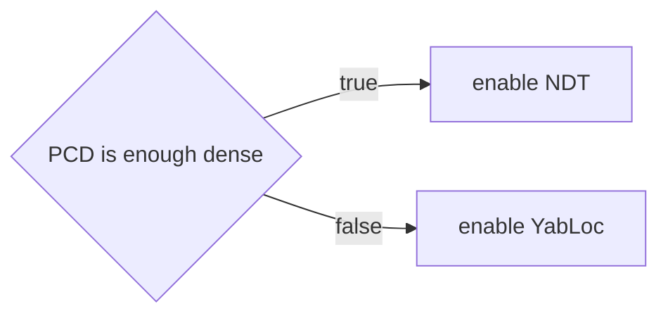
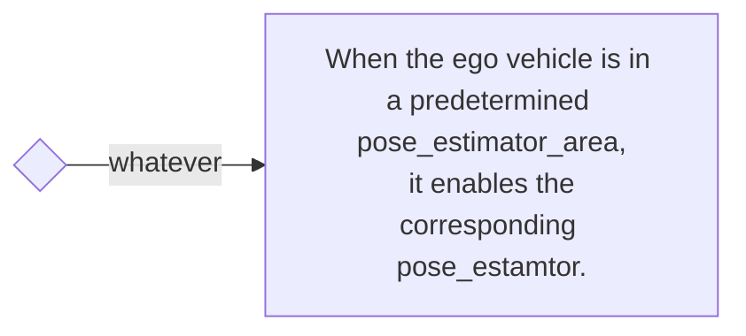

<a id="example-rule"></a>

# 示例规则

示例规则提供控制仲裁器的参考实现。通过组合所提供的规则，可以实现下述演示。用户可参考这些代码按需扩展规则，从而以期望的方式控制仲裁器。

<a id="demonstration"></a>

## 演示

以下视频演示了四种不同位姿估计器之间的切换。

<div><video controls src="https://github-production-user-asset-6210df.s3.amazonaws.com/24854875/295755577-62b26fdd-dcf0-4b1c-a1a0-ecd633413196.mp4" muted="false" width="600"></video></div>

<a id="switching-rules"></a>

## 切换规则

<a id="pcd-map-based-rule"></a>

### 基于 PCD 地图的规则



<a id="vector-map-based-rule"></a>

### 基于矢量地图的规则



<a id="rule-helpers"></a>

### 规则辅助工具

规则辅助工具用于辅助描述切换规则。

- [PCD 占据情况](#pcd-occupancy)
- [位姿估计器区域](#pose-estimator-area)

<a id="pcd-occupancy"></a>

#### PCD 占据情况


<a id="pose-estimator-area"></a>

#### 位姿估计器区域

pose_estimator_area 是通过 Lanelet2 多边形描述的平面区域。
区域高度没有实际意义；判断依据是自车位置的投影是否位于该多边形内。


以下展示一个 pose_estimator_area 示例，其中给出的值均为占位值。
为确保正确读取，区域的 type 应为 "pose_estimator_specify"，subtype 应为 ndt、yabloc、eagleye 或 artag 之一。

```xml
  <node id="1" lat="35.8xxxxx" lon="139.6xxxxx">
    <tag k="mgrs_code" v="54SUE000000"/>
    <tag k="local_x" v="10.0"/>
    <tag k="local_y" v="10.0"/>
    <tag k="ele" v="1.0"/>
  </node>
  <node id="2" lat="35.8xxxxx" lon="139.6xxxxx">
    <tag k="mgrs_code" v="54SUE000000"/>
    <tag k="local_x" v="10.0"/>
    <tag k="local_y" v="20.0"/>
    <tag k="ele" v="1.0"/>
  </node>
  <node id="3" lat="35.8xxxxx" lon="139.6xxxxx">
    <tag k="mgrs_code" v="54SUE000000"/>
    <tag k="local_x" v="20.0"/>
    <tag k="local_y" v="20.0"/>
    <tag k="ele" v="1.0"/>
  </node>
  <node id="4" lat="35.8xxxxx" lon="139.6xxxxx">
    <tag k="mgrs_code" v="54SUE000000"/>
    <tag k="local_x" v="10.0"/>
    <tag k="local_y" v="20.0"/>
    <tag k="ele" v="1.0"/>
  </node>

...

  <way id="5">
    <nd ref="1"/>
    <nd ref="2"/>
    <nd ref="3"/>
    <nd ref="4"/>
    <tag k="type" v="pose_estimator_specify"/>
    <tag k="subtype" v="eagleye"/>
    <tag k="area" v="yes"/>
  </way>

  <way id="6">
    <nd ref="7"/>
    <nd ref="8"/>
    <nd ref="9"/>
    <nd ref="10"/>
    <tag k="type" v="pose_estimator_specify"/>
    <tag k="subtype" v="yabloc"/>
    <tag k="area" v="yes"/>
  </way>

```
