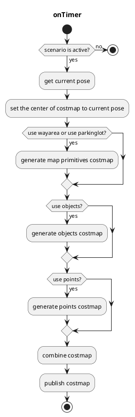

# costmap_generator

## costmap_generator_node

此节点读取 `PointCloud` 和/或 `DynamicObjectArray`，并创建 `OccupancyGrid` 和 `GridMap`。`VectorMap(Lanelet2)` 为可选输入。

### 输入话题

| 名称 | 类型 | 说明 |
| ------------------------- | ------------------------------------------ | ---------------------------------------------------------------------------- |
| `~input/objects` | autoware_perception_msgs::PredictedObjects | 预测对象，用于障碍物区域 |
| `~input/points_no_ground` | sensor_msgs::PointCloud2 | 去除地面后的点云，用于无法被检测为对象的障碍物区域 |
| `~input/vector_map` | autoware_map_msgs::msg::LaneletMapBin | 矢量地图，用于可行驶区域 |
| `~input/scenario` | tier4_planning_msgs::Scenario | 用于激活节点的场景 |

### 输出话题

| 名称 | 类型 | 说明 |
| ------------------------ | ----------------------- | -------------------------------------------------- |
| `~output/grid_map` | grid_map_msgs::GridMap | GridMap 格式的代价地图，取值范围为 0.0 到 1.0 |
| `~output/occupancy_grid` | nav_msgs::OccupancyGrid | OccupancyGrid 格式的代价地图，取值范围为 0 到 100 |

### 输出 TF

无

### 启动方法

1. 执行命令 `source install/setup.bash` 设置环境

2. 运行 `ros2 launch costmap_generator costmap_generator.launch.xml` 启动节点

### 参数

| 名称 | 类型 | 说明 |
| ---------------------------- | ------ | ---------------------------------------------------------------------------------------------- |
| `update_rate` | double | 定时器更新频率 |
| `activate_by_scenario` | bool | 若为 true，则当场景为 parking 时激活。否则，当车辆位于停车场内时激活。 |
| `use_objects` | bool | 是否使用 `~input/objects` |
| `use_points` | bool | 是否使用 `~input/points_no_ground` |
| `use_wayarea` | bool | 是否使用 `~input/vector_map` 中的 `wayarea` |
| `use_parkinglot` | bool | 是否使用 `~input/vector_map` 中的 `parkinglot` |
| `costmap_frame` | string | 生成的代价地图的坐标系 |
| `vehicle_frame` | string | 车辆坐标系 |
| `map_frame` | string | 地图坐标系 |
| `grid_min_value` | double | 栅格地图的最小代价值 |
| `grid_max_value` | double | 栅格地图的最大代价值 |
| `grid_resolution` | double | 栅格地图分辨率 |
| `grid_length_x` | int | 栅格地图在 x 方向上的尺寸 |
| `grid_length_y` | int | 栅格地图在 y 方向上的尺寸 |
| `grid_position_x` | int | 相对于坐标系在 x 方向上的偏移 |
| `grid_position_y` | int | 相对于坐标系在 y 方向上的偏移 |
| `maximum_lidar_height_thres` | double | 点云数据的最大高度阈值（相对于 vehicle_frame） |
| `minimum_lidar_height_thres` | double | 点云数据的最小高度阈值（相对于 vehicle_frame） |
| `expand_rectangle_size` | double | 使用此值扩展对象的矩形 |
| `size_of_expansion_kernel` | int | 对对象代价地图进行模糊处理的核大小 |

### 流程图

