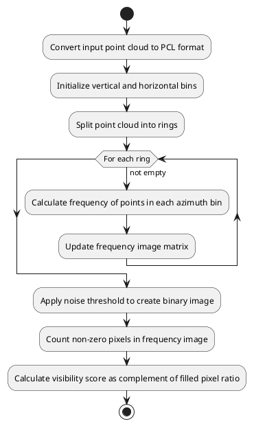

# ring_outlier_filter

## 用途

此节点旨在移除昆虫、雨等点云噪声。

## 内部机制／算法

按时间顺序处理扫描，并根据点间距离的变化率移除噪声的方法。

此节点还会根据离群点云计算能见度评分，并通过话题发布该评分。

### 能见度评分计算算法

将点云划分为垂直分箱（扫描环）和水平分箱（方位角分区）。
算法首先根据每个点的 ring 值，将输入点云拆分为独立的扫描环。然后遍历各扫描环中的点，统计每个水平分箱内的点数。根据点的方位角，为对应分箱的计数器加一，从而得到频数。
频数存储在频数图像矩阵中，每个单元格代表特定扫描环和方位角分箱。生成频数图像后，算法应用噪声阈值生成二值图像。频数高于噪声阈值的点视为有效点，低于阈值的点视为噪声。
最后，统计频数图像中的非零像素数，再除以总像素数（垂直分箱数乘以水平分箱数），得到能见度评分。

## 输入／输出

此实现继承 `autoware::pointcloud_preprocessor::Filter` 类，请参阅 [README](../README.md)。

## 参数

### 节点参数

此实现继承 `autoware::pointcloud_preprocessor::Filter` 类，请参阅 [README](../README.md)。

### 核心参数

{{ json_to_markdown("sensing/autoware_pointcloud_preprocessor/schema/ring_outlier_filter_node.schema.json") }} |

## 前提假设／已知限制

此节点要求输入点云中的点按时间顺序排列，且每个点遵循 [PointXYZIRCAEDT](https://github.com/autowarefoundation/autoware_core/blob/main/common/autoware_point_types/include/autoware/point_types/types.hpp#L95-L116) 指定的内存布局。

## （可选）错误检测与处理

## （可选）性能特征

## （可选）参考资料／外部链接

## （可选）后续扩展／尚未实现的部分
